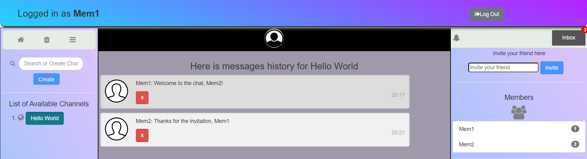

# Chatroom

Website found here: https://messagetastic.herokuapp.com/

You can use the following credentials if you don't want to sign up:  
- Email: demo_account@gmail.com  
- Password: 123456

## Installation
##### Installation via requirements.txt
    cd Chatroom
    mkvirtualenv Chatroom
    pip3 install -r requirements.txt
    flask run

## Usage
##### Create a .env file in project folder
##### Replace the following values with yours in .env file
* `FLASK_APP`: Entry point of the application(should be 'wsgi.py')
* `FLASK_ENV`: Enable/Disable development mode by setting it to development/production
* `SECRET_KEY`: Randomly generated string of characters used to encrypt your app's data.'
* `DATABASE_URL`: URI of a SQL database
* `DEBUG`: Enable/Disable debug mode by setting it to True/False
* `TESTING`: Enable/Disable testing mode by setting it to True/False

## Collaborator
* [TenLaGi123](https://github.com/TenLaGi123)
